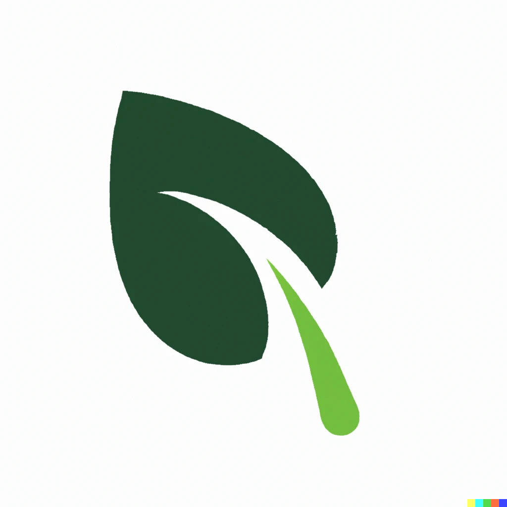

# AutoGro
Docs 5-11-23 V1  

### Project Overview:
AutoGro is an innovative project that combines automation, AI, and blockchain technology to grow fresh and healthy food sustainably. The system uses smart sensors and various electronics to collect data on and manage crop growth conditions, which an AI algorithm optimizes for maximum yield and quality. Blockchain records all relevant information on the food growing process, ensuring transparency and traceability for consumers. AutoGro's advanced technology offers a sustainable, efficient, and transparent solution to food production challenges.

